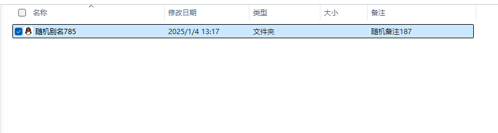
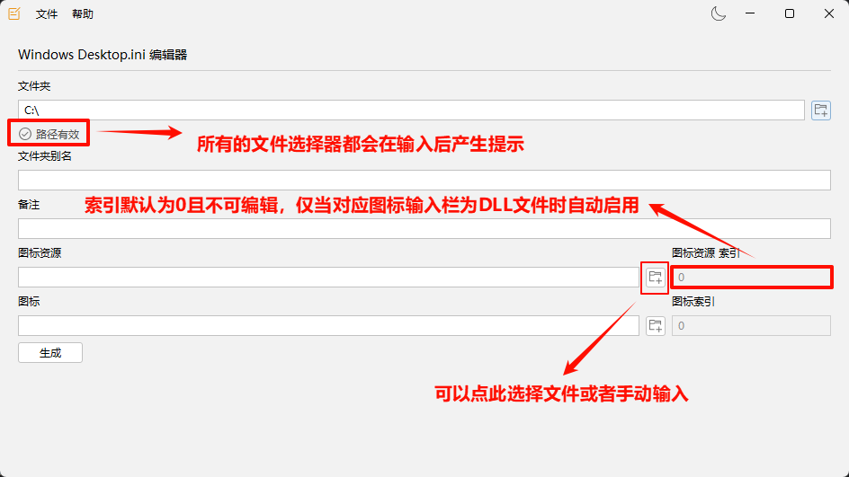

### Windows Desktop.ini Editor

#### 简介

这是一个可以生成和编辑Windows系统中Desktop.ini文件的Java Swing项目。

#### Desktop.ini

##### 介绍

我们以**文档**为例。它在Windows资源管理器中显示如下：


而它的实际路径却是*C:\Users\用户名\Documents*。

和普通的文件夹相比，它具有以下特征：

1. 它拥有一个特殊的文件夹图标。
2. 它拥有一个不同于文件路径的“别名”。

除此之外，Desktop.ini还允许给文件夹设置备注。

```properties
[.ShellClassInfo]
LocalizedResourceName = 随机别名785
InfoTip = 随机备注187
IconResource = C:\Tencent\QQNT\QQ.exe, 0
```

比如上方的Desktop.ini文件可以为文件夹提供如下的效果：


##### 警告

如果你不清楚什么是Desktop.ini，最好不要使用该程序。

避免修改到Windows系统自带的文件。

如果你想了解Desktop.ini的基本结构，可以阅读[此文章](https://learn.microsoft.com/zh-cn/windows/win32/shell/how-to-customize-folders-with-desktop-ini)。

#### 程序

注意，本程序不支持DLL文件的解析，所以当选择DLL文件后，图标索引的值需要自行判断。

本程序界面如下：




